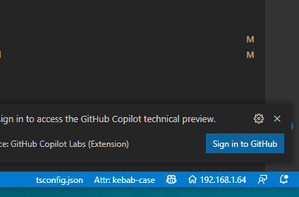

# vscode-show-ip

just show WLAN IP Address in StatusBar

Your can see your ipv4 address on the StatusBar in the bottom right corner

you can click it or exec command `vscode-show-ip.next` to change

## Configuration

|title|default|description|
|--|--|--|
|showIp.interfaceName|`WLAN`|show this interface ip4 address

## License

[MIT](./LICENSE) License © 2022 [kkopitehong](https://github.com/action-hong)
